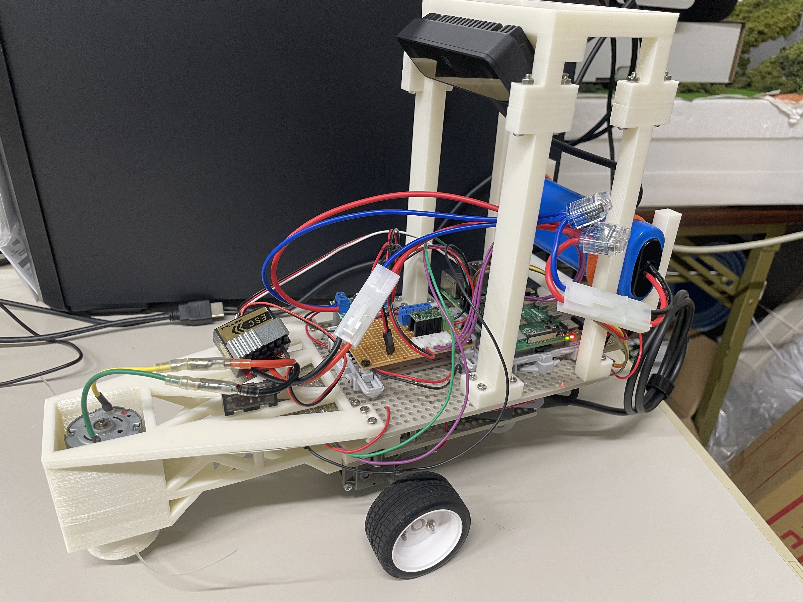

# weeding_robot

## Overview
This is the source code of the weeding robot I made for my senior year graduation project. When the robot detects a weed using an object detection model, it rotates a nylon cord cutter to cut the weed.

## Requirement

### Software
Ubuntu 20.04  
ROS2 Foxy  

### Hardware
Raspberry Pi 4B 4GB  
Luxionis OAK-D S2 (fixed focus)

## Usage

## Features

## Reference

## Author

## Licence
